# Aerial Object Detection System — Architecture

## Architecture Diagram

```mermaid
flowchart LR

    subgraph Client["Client Layer"]
        CLI["CLI Scripts<br/><i>train.py / inference.py / evaluate.py</i>"]
        API["Python API<br/><i>Predictor / DOTAEvaluator</i>"]
    end

    subgraph DataLayer["Data Layer"]
        direction TB
        DOTA_RAW["DOTA Dataset<br/><i>4K–20K images + polygon labels</i>"]
        PARSER["Annotation Parser<br/><i>parse_dota_annotation()</i>"]
        ORGANIZE["organize_dota.py<br/><i>Dataset organizer</i>"]
        SPLITS["Split Manager<br/><i>train.txt / val.txt</i>"]
        DOTA_RAW --> ORGANIZE --> PARSER
        DOTA_RAW --> SPLITS
    end

    subgraph Preprocessing["Preprocessing Layer"]
        direction TB
        PATCH["Patch Generator<br/><i>1024×1024, 25% overlap</i>"]
        AUG["Augmentations<br/><i>Flip, Rotate90, Scale,<br/>Brightness, Contrast</i>"]
        NORM["Normalize + ToTensor<br/><i>ImageNet μ/σ</i>"]
        DS_TRAIN["DOTAPatchDataset<br/><i>PyTorch Dataset</i>"]
        DS_FULL["DOTADataset<br/><i>Full-image loader</i>"]
        PATCH --> AUG --> NORM --> DS_TRAIN
        NORM --> DS_FULL
    end

    subgraph GeometryEngine["Geometry Engine"]
        direction TB
        OBB["OBB<br/><i>(cx, cy, w, h, θ)</i>"]
        RIOU["Rotated IoU<br/><i>Shapely polygon intersection</i>"]
        RNMS["Rotated NMS<br/><i>Class-wise suppression</i>"]
        OBB --> RIOU --> RNMS
    end

    subgraph ModelLayer["Model Layer — Rotated RetinaNet"]
        direction TB
        BACKBONE["Backbone<br/><i>ResNet-50/101 (C2–C5)</i>"]
        FPN["FPN<br/><i>P3–P7 pyramid</i>"]
        ANCHORS["Anchor Generator<br/><i>18/location (3 ratios × 6 angles)</i>"]
        HEADS["Detection Heads<br/><i>ClassificationHead + RegressionHead</i>"]
        LOSS["Loss Functions<br/><i>FocalLoss + SmoothL1 + AngleLoss</i>"]
        ASSIGN["Target Assignment<br/><i>IoU-based anchor matching</i>"]
        ENCODE["Box Encode / Decode<br/><i>Δ(cx,cy,w,h,θ)</i>"]
    

        BACKBONE --> FPN --> ANCHORS --> HEADS
        HEADS --> ENCODE
        ASSIGN --> LOSS
    end

    subgraph TrainingPipeline["Training Pipeline"]
        direction TB
        OPTIM["AdamW Optimizer<br/><i>lr=0.01, wd=1e-4</i>"]
        SCHED["LR Scheduler<br/><i>StepLR (steps 8,11)</i>"]
        GRAD["Gradient Clipping<br/><i>max_norm=10.0</i>"]
        CKPT["Checkpointing<br/><i>best + periodic + latest</i>"]
        OPTIM --> GRAD --> SCHED --> CKPT
    end

    subgraph InferencePipeline["Inference Pipeline"]
        direction TB
        SAHI["SAHI Slicer<br/><i>Auto if dim > 2048px</i>"]
        MERGER["Detection Merger<br/><i>Coord transform + NMS</i>"]
        PRED["Predictor<br/><i>High-level API</i>"]
        SAHI --> PRED
        MERGER --> PRED
    end

    subgraph PostProcessing["Post-Processing"]
        direction TB
        CONF["Confidence Filter<br/><i>threshold=0.5</i>"]
        NMS_POST["Class-wise NMS<br/><i>IoU threshold=0.5</i>"]
        CONF --> NMS_POST
    end

    subgraph EvalLayer["Evaluation Layer"]
        direction TB
        EVALUATOR["DOTAEvaluator<br/><i>mAP@0.5</i>"]
        METRICS["Metrics<br/><i>Per-class AP, Small Obj Recall,<br/>Precision, Recall</i>"]
        EVALUATOR --> METRICS
    end

    subgraph OutputLayer["Output Layer"]
        direction TB
        JSON_OUT["JSON Predictions<br/><i>OBB + Polygon formats</i>"]
        VIZ["Visualization<br/><i>draw_obb, comparison views</i>"]
        CKPT_OUT["Model Checkpoints<br/><i>.pth files</i>"]
        LOG["Training Logs<br/><i>loss, mAP per epoch</i>"]
    end

    %% ===== DATA FLOW =====

    %% Client → Pipelines
    CLI --> DataLayer
    CLI --> TrainingPipeline
    CLI --> InferencePipeline
    CLI --> EvalLayer
    API --> InferencePipeline
    API --> EvalLayer

    %% Data → Preprocessing
    PARSER --> Preprocessing
    SPLITS --> Preprocessing

    %% Geometry used everywhere
    GeometryEngine -.-> ModelLayer
    GeometryEngine -.-> InferencePipeline
    GeometryEngine -.-> EvalLayer
    GeometryEngine -.-> Preprocessing

    %% Training flow
    DS_TRAIN --> ModelLayer
    ENCODE --> ASSIGN
    LOSS --> TrainingPipeline
    TrainingPipeline --> CKPT_OUT
    TrainingPipeline --> LOG

    %% Inference flow
    DS_FULL --> InferencePipeline
    InferencePipeline --> ModelLayer
    HEADS --> PostProcessing
    PostProcessing --> MERGER
    PRED --> JSON_OUT
    PRED --> VIZ

    %% Evaluation flow
    EVALUATOR --> METRICS
    PRED --> EVALUATOR
    PARSER --> EVALUATOR
```

## Detected Components

| Component | Module | Role |
|---|---|---|
| OBB | `geometry/obb.py` | 5-param oriented bounding box with angle normalization to [-90°, 90°) |
| Rotated IoU | `geometry/rotated_iou.py` | Polygon-based IoU via Shapely; single, batch, and 1-vs-N variants |
| Rotated NMS | `geometry/rotated_nms.py` | Greedy class-wise NMS using rotated IoU |
| DOTA Parser | `data/dota_dataset.py` | Parses 8-point polygon annotations → OBB; handles header lines and difficulty flags |
| DOTAPatchDataset | `data/dota_dataset.py` | PyTorch Dataset that serves pre-sliced 1024×1024 patches for training |
| DOTADataset | `data/dota_dataset.py` | Full-image loader for inference and evaluation |
| PatchGenerator | `data/patch_generator.py` | Sliding-window slicer with visibility filtering (≥30% visible) |
| Augmentations | `data/transforms.py` | Rotation-aware transforms: flip, 90° rotate, scale, brightness, contrast, normalize |
| Backbone | `models/backbone.py` | ResNet-50/101 feature extractor producing C2–C5 multi-scale features |
| FPN | `models/fpn.py` | Feature Pyramid Network fusing C3–C5 into P3–P7 (all 256-ch) |
| Anchor Generator | `models/anchor_generator.py` | 18 rotated anchors per spatial location (3 ratios × 6 angles) |
| Detection Heads | `models/heads.py` | 4-layer conv classification head + regression head (shared architecture) |
| Loss Functions | `models/losses.py` | Focal loss (α=0.25, γ=2), smooth L1, angle-aware smooth L1 with periodicity |
| RotatedRetinaNet | `models/rotated_retinanet.py` | End-to-end model composing backbone, FPN, anchors, heads, and loss |
| SAHI Slicer | `inference/sahi_slicer.py` | Slices large images into overlapping patches with coordinate tracking |
| Detection Merger | `inference/detection_merger.py` | Transforms patch-local coords to image-global, applies class-wise NMS |
| Predictor | `inference/predictor.py` | High-level API; auto-enables SAHI when any dimension > 2048px |
| DOTAEvaluator | `evaluation/metrics.py` | mAP@0.5 with 11-point interpolation, per-class AP, small object recall |
| I/O Utils | `utils/io.py` | JSON serialization for detections (OBB and polygon formats) |
| Visualization | `utils/visualization.py` | OBB drawing, detection overlays, side-by-side GT vs prediction comparison |
| train.py | `scripts/train.py` | Training loop with AdamW, StepLR, gradient clipping, checkpointing |
| inference.py | `scripts/inference.py` | Batch inference CLI with SAHI support and JSON output |
| evaluate.py | `scripts/evaluate.py` | Evaluation CLI computing mAP on DOTA val/test splits |
| organize_dota.py | `scripts/organize_dota.py` | Reorganizes raw DOTA downloads into expected directory structure |
| Config | `config/defaults.py` | 15 DOTA classes, TrainingConfig dataclass, default thresholds |

## Infrastructure

| Aspect | Detail |
|---|---|
| Compute | Single-GPU training (CUDA); CPU fallback supported |
| Framework | PyTorch 2.0+ with torchvision |
| Batch processing | DataLoader with configurable workers and collate_fn |
| Storage | Local filesystem; checkpoints in `outputs/run_<timestamp>/` |
| Serialization | JSON for predictions; `.pth` for model checkpoints |
| Testing | Property-based tests via Hypothesis + pytest |
| Package | pip-installable via `pyproject.toml` (setuptools backend) |
| No external services | No REST API, message queue, cloud storage, or monitoring stack — purely local pipeline |

## Data Flow Summary

**Training:** DOTA images → parse annotations → generate patches (1024²) → augment → normalize → backbone (ResNet) → FPN (P3–P7) → anchors → heads → target assignment (IoU-based) → focal loss + box loss → AdamW + gradient clip → checkpoint

**Inference:** Input image → auto-SAHI if >2048px → slice into patches → per-patch: normalize → backbone → FPN → heads → decode boxes → confidence filter → merge patches (coord transform) → class-wise NMS → JSON output / visualization
