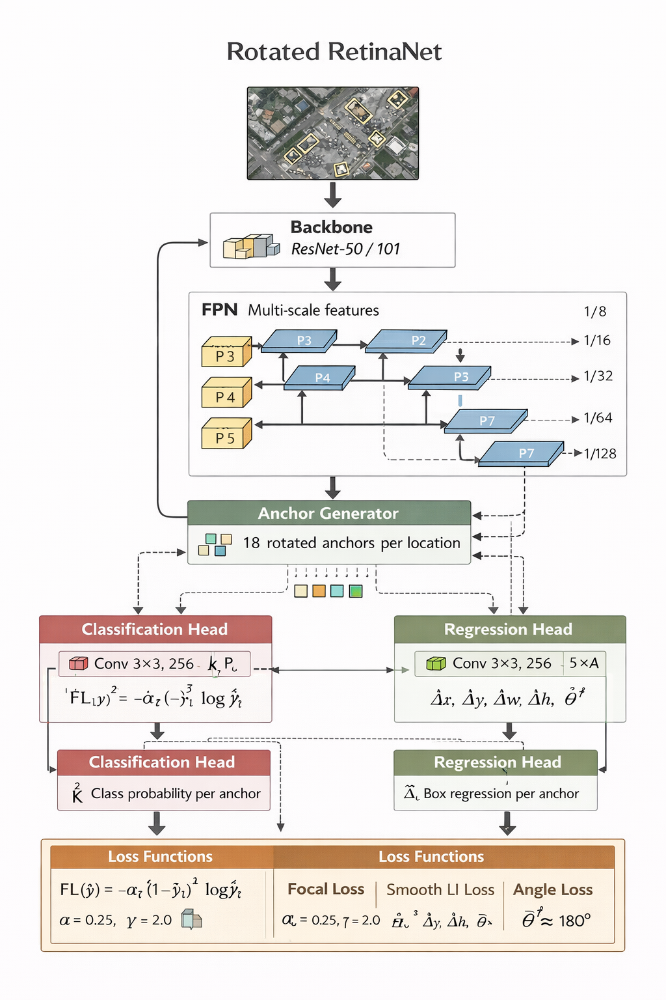
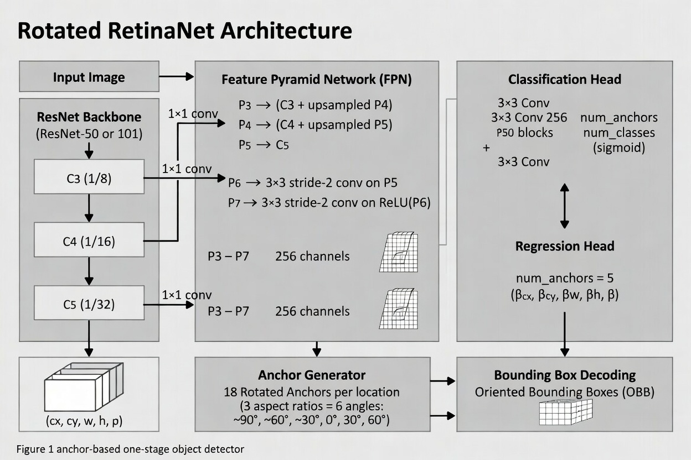

# Aerial Object Detection System

[](https://www.python.org/downloads/)
[](LICENSE)
[](https://pytorch.org/)

A production-ready pipeline for detecting small, rotated objects in high-resolution satellite imagery (4K–20K pixels). Built on Rotated RetinaNet with SAHI-based inference, targeting the [DOTA dataset](https://captain-whu.github.io/DOTA/).

**Key Capabilities:**
- Detects objects as small as 5–30 pixels across 15 DOTA classes
- Handles arbitrarily rotated objects using Oriented Bounding Boxes (OBB)
- Processes images up to 20,000×20,000 pixels via SAHI slicing
- Real-time inference on GPU hardware

## Demo


---

## Quick Start

```bash
# Clone and install
git clone <repo-url>
cd aerial-detection
pip install -e ".[dev]"

# Organize your DOTA dataset
python -m aerial_detection.scripts.organize_dota --data_root data/dota

# Train
python -m aerial_detection.scripts.train \
    --data_root data/dota \
    --pretrained \
    --epochs 50 \
    --batch_size 4

# Inference on a single image
python -m aerial_detection.scripts.inference \
    --checkpoint outputs/<run_dir>/checkpoint_best.pth \
    --input test_image.png \
    --output results.json

# Evaluate
python -m aerial_detection.scripts.evaluate \
    --checkpoint outputs/<run_dir>/checkpoint_best.pth \
    --data_root data/dota \
    --split val
```

---

## Table of Contents

1. [System Architecture](#system-architecture)
2. [Model Architecture](#model-architecture)
3. [Mathematical Foundations](#mathematical-foundations)
4. [Geometry Engine](#geometry-engine)
5. [Data Pipeline](#data-pipeline)
6. [Model Details](#model-details)
7. [Inference Pipeline](#inference-pipeline)
8. [Evaluation](#evaluation)
9. [Training Guide](#training-guide)
10. [Inference Guide](#inference-guide)
11. [Evaluation Guide](#evaluation-guide)
12. [Design Decisions & Trade-offs](#design-decisions--trade-offs)
13. [Future Improvements](#future-improvements)
14. [Troubleshooting](#troubleshooting)
15. [Testing](#testing)
16. [References](#references)

---

## System Architecture

### High-Level Pipeline

```
┌─────────────────────────────────────────────────────────────────────────────┐
│                        AERIAL OBJECT DETECTION SYSTEM                        │
├─────────────────────────────────────────────────────────────────────────────┤
│                                                                              │
│  ┌──────────────┐    ┌──────────────┐    ┌──────────────┐    ┌───────────┐ │
│  │   GEOMETRY   │    │     DATA     │    │    MODEL     │    │ INFERENCE │ │
│  │    ENGINE    │───▶│   PIPELINE   │───▶│ ARCHITECTURE │───▶│  PIPELINE │ │
│  └──────────────┘    └──────────────┘    └──────────────┘    └───────────┘ │
│        │                    │                   │                   │       │
│        ▼                    ▼                   ▼                   ▼       │
│  • OBB Operations    • DOTA Parser      • Backbone+FPN      • SAHI Slicer  │
│  • Rotated IoU       • Patch Generator  • Anchor Generator  • Detection    │
│  • Rotated NMS       • Augmentations    • Detection Heads     Merger       │
│                                         • Loss Functions    • Predictor    │
│                                                                              │
└─────────────────────────────────────────────────────────────────────────────┘
```

### Directory Structure

```
aerial_detection/
├── config/
│   ├── __init__.py
│   └── defaults.py          # DOTA classes, default hyperparameters
├── geometry/
│   ├── __init__.py
│   ├── obb.py               # Oriented Bounding Box class
│   ├── rotated_iou.py       # Rotated IoU calculation
│   └── rotated_nms.py       # Rotated Non-Maximum Suppression
├── data/
│   ├── __init__.py
│   ├── dota_dataset.py      # DOTA dataset loader
│   ├── patch_generator.py   # Image patching for training
│   └── transforms.py        # Data augmentations
├── models/
│   ├── __init__.py
│   ├── backbone.py          # ResNet/Swin backbone
│   ├── fpn.py               # Feature Pyramid Network
│   ├── anchor_generator.py  # Rotated anchor generation
│   ├── heads.py             # Classification & regression heads
│   ├── losses.py            # Focal loss, box regression loss
│   └── rotated_retinanet.py # Main model class
├── inference/
│   ├── __init__.py
│   ├── sahi_slicer.py       # SAHI image slicing
│   ├── detection_merger.py  # Merge detections from patches
│   └── predictor.py         # High-level inference API
├── evaluation/
│   ├── __init__.py
│   └── metrics.py           # mAP, per-class AP, small object recall
├── utils/
│   ├── __init__.py
│   ├── io.py                # Detection serialization
│   └── visualization.py     # Drawing utilities
└── scripts/
    ├── __init__.py
    ├── train.py             # Training script
    ├── inference.py         # Inference script
    ├── evaluate.py          # Evaluation script
    └── organize_dota.py     # Dataset organization
```

### Dependencies

```toml
# Core
torch >= 2.0.0
torchvision >= 0.15.0
numpy >= 1.24.0
opencv-python >= 4.8.0
Pillow >= 10.0.0

# Geometry
shapely >= 2.0.0           # Polygon operations for IoU

# Dev / Testing
hypothesis >= 6.82.0       # Property-based testing
pytest >= 7.4.0
pytest-cov >= 4.1.0
```

Install with:
```bash
pip install -e .          # core only
pip install -e ".[dev]"   # core + testing
```

---

## Model Architecture

We use a **Rotated RetinaNet** (one-stage anchor-based rotated object detector) based on RetinaNet + oriented bounding box (OBB) support.

### Overall Pipeline



*High-level view: backbone → FPN → anchors → classification & regression heads with Focal Loss + regression losses (including angle).*

### Detailed Anchor & Head Design



*Detailed structure showing FPN construction (P3–P7), 18 rotated anchors per location (3 aspect ratios × 6 angles), and 5-parameter regression head (Δx, Δy, Δw, Δh, Δθ).*

---

## Mathematical Foundations

### Oriented Bounding Box (OBB) Representation

An OBB is defined by 5 parameters: `(x_center, y_center, width, height, theta)`

```
        theta (rotation angle)
              ↗
    ┌─────────────────┐
    │                 │ height
    │    (cx, cy)     │
    │        •        │
    │                 │
    └─────────────────┘
          width
```

**Angle Convention:**
- `theta` is in degrees, range `[-90°, 90°)`
- Positive theta = counter-clockwise rotation
- Width is along the rotated x-axis

**Why this representation?**
- Compact (5 values vs 8 for polygon)
- Directly regressed by neural network
- Angle normalization prevents ambiguity

### OBB to Polygon Conversion

```python
# Rotation matrix
R = [[cos(θ), -sin(θ)],
     [sin(θ),  cos(θ)]]

# Corner offsets (before rotation)
corners_local = [[-w/2, -h/2],  # top-left
                 [ w/2, -h/2],  # top-right
                 [ w/2,  h/2],  # bottom-right
                 [-w/2,  h/2]]  # bottom-left

# Apply rotation and translate
corners = corners_local @ R.T + [cx, cy]
```

### Polygon to OBB Conversion

Uses OpenCV's `minAreaRect` (rotating calipers algorithm, O(n log n)):

```python
rect = cv2.minAreaRect(polygon.astype(np.float32))
(cx, cy), (w, h), angle = rect
```

### Rotated IoU Calculation

Standard axis-aligned IoU fails for rotated objects:

```
Standard IoU:           Rotated IoU:
┌───┐                   ╱╲
│ ┌─┼─┐                ╱  ╲
│ │ │ │  IoU ≈ 0.3    ╱ ╱╲ ╲  IoU ≈ 0.8
└─┼─┘ │               ╲╱  ╲╱
  └───┘                ╲  ╱
                        ╲╱
```

Algorithm: Convert OBBs to polygons → compute intersection via Shapely → `IoU = intersection_area / union_area`

```python
def rotated_iou(obb1, obb2):
    poly1 = Polygon(obb1.to_polygon())
    poly2 = Polygon(obb2.to_polygon())
    intersection = poly1.intersection(poly2).area
    union = poly1.area + poly2.area - intersection
    return intersection / union
```

### Rotated Non-Maximum Suppression (NMS)

Removes duplicate detections. Class-wise NMS ensures different classes don't suppress each other.

```python
def rotated_nms(boxes, scores, iou_threshold=0.5):
    order = np.argsort(scores)[::-1]
    keep = []
    suppressed = set()
    for idx in order:
        if idx in suppressed:
            continue
        keep.append(idx)
        for other_idx in order:
            if other_idx not in suppressed:
                if rotated_iou(boxes[idx], boxes[other_idx]) > iou_threshold:
                    suppressed.add(other_idx)
    return keep
```

---

## Geometry Engine

### OBB Class (`geometry/obb.py`)

```python
@dataclass
class OBB:
    x_center: float
    y_center: float
    width: float
    height: float
    theta: float  # degrees, [-90, 90)
```

**Angle normalization:** Normalizes to `[-90°, 90°)` with width/height swap to prevent ambiguity (`theta=0°` and `theta=180°` represent the same box).

**Round-trip property:** `OBB → Polygon → OBB` produces equivalent OBB, verified by property-based tests.

### Rotated IoU (`geometry/rotated_iou.py`)

Uses Shapely for robust polygon clipping. Supports single-pair, batch (NxM matrix), and 1-vs-N computation.

### Rotated NMS (`geometry/rotated_nms.py`)

Three variants: basic NMS, class-wise NMS, and batched NMS (per image in batch). Performance: O(n² × IoU_cost), typically <10ms on CPU for 100–1000 detections.

---

## Data Pipeline

### DOTA Dataset Format

```
# Annotation format (per line):
x1 y1 x2 y2 x3 y3 x4 y4 class_name difficulty

# Example:
2753 2408 2861 2385 2888 2468 2805 2502 plane 0
```

**15 DOTA Classes:** plane, baseball-diamond, bridge, ground-track-field, small-vehicle, large-vehicle, ship, tennis-court, basketball-court, storage-tank, soccer-ball-field, roundabout, harbor, swimming-pool, helicopter

### Dataset Organization

```
data/dota/
├── train/
│   ├── images/
│   └── labelTxt/
├── val/
│   ├── images/
│   └── labelTxt/
├── test/
│   └── images/
└── splits/
    ├── train.txt
    └── val.txt
```

### Patch Generator (`data/patch_generator.py`)

DOTA images are 4000×4000+ pixels. The patch generator slices them into overlapping 1024×1024 patches with 25% overlap. Only annotations with ≥30% visibility inside the patch are included.

### Data Augmentations (`data/transforms.py`)

Rotation-aware transforms that correctly update OBB angles:
- Random horizontal/vertical flip
- Random 90° rotation
- Random scale (0.8–1.2×)
- Random brightness/contrast
- ImageNet normalization

```python
def get_train_transforms():
    return Compose([
        RandomHorizontalFlip(p=0.5),
        RandomVerticalFlip(p=0.5),
        RandomRotation(max_angle=15, p=0.3),
        RandomScale(scale_range=(0.8, 1.2), p=0.3),
        Normalize(mean=[0.485, 0.456, 0.406], std=[0.229, 0.224, 0.225]),
        ToTensor()
    ])
```

---

## Model Details

### Architecture Overview

```
Input Image (B, 3, H, W)
         │
         ▼
┌─────────────────────┐
│      BACKBONE       │  ResNet-50/101
│   (Feature Extractor)│
└─────────────────────┘
         │
    C2, C3, C4, C5 (multi-scale features)
         │
         ▼
┌─────────────────────┐
│        FPN          │  Feature Pyramid Network
│  (Multi-scale Fusion)│
└─────────────────────┘
         │
    P3, P4, P5, P6, P7 (pyramid features)
         │
         ▼
┌─────────────────────┐
│  ANCHOR GENERATOR   │  Rotated anchors at each location
└─────────────────────┘
         │
         ▼
┌─────────────────────┐
│   DETECTION HEADS   │
│  ┌───────┐ ┌───────┐│
│  │  CLS  │ │  REG  ││  Classification + Box Regression
│  └───────┘ └───────┘│
└─────────────────────┘
         │
         ▼
    Predictions (boxes, scores, labels)
```

### Backbone (`models/backbone.py`)

- ResNet-50 (default): Good balance of speed/accuracy
- ResNet-101: Higher accuracy, slower

Output channels: C2=256, C3=512, C4=1024, C5=2048. After FPN: all levels = 256 channels.

### Feature Pyramid Network (`models/fpn.py`)

```
C5 (2048ch) ──▶ P5 (256ch)
                    │ 2x upsample
C4 (1024ch) ──▶ P4 (256ch)
                    │ 2x upsample
C3 (512ch)  ──▶ P3 (256ch)

P5 ──▶ stride 2 ──▶ P6 (256ch)
P6 ──▶ stride 2 ──▶ P7 (256ch)
```

### Rotated Anchor Generator (`models/anchor_generator.py`)

- Sizes: [32, 64, 128, 256, 512] (one per FPN level)
- Aspect ratios: [0.5, 1.0, 2.0]
- Angles: [-90°, -60°, -30°, 0°, 30°, 60°]
- Anchors per location: 3 × 6 = 18
- Total for 1024×1024: ~392K anchors

### Detection Heads (`models/heads.py`)

4-layer conv heads (shared architecture, separate weights):
- Classification: outputs `num_anchors × num_classes` per location
- Regression: outputs `num_anchors × 5` (Δx, Δy, Δw, Δh, Δθ) per location
- Classification bias initialized for rare positive rate (π=0.01)

### Loss Functions (`models/losses.py`)

**Focal Loss** (classification): Handles extreme class imbalance (99%+ background anchors)
```
FL(p_t) = -α_t × (1 - p_t)^γ × log(p_t)    α=0.25, γ=2.0
```

**Smooth L1** (box regression): Robust to outliers for dx, dy, dw, dh

**Angle-aware Smooth L1** (angle regression): Handles wrap-around at ±90°

**Anchor-target assignment:** IoU ≥ 0.5 → positive, IoU < 0.4 → negative, between → ignore. Each GT guaranteed at least one positive anchor.

**Box encoding/decoding:**
```python
# Encode (GT relative to anchor)
dx = (gx - ax) / aw;  dy = (gy - ay) / ah
dw = log(gw / aw);    dh = log(gh / ah)
dθ = normalize(gθ - aθ)
```

---

## Inference Pipeline

### SAHI Slicing (`inference/sahi_slicer.py`)

Slices large images into overlapping 1024×1024 patches (25% overlap). Auto-enabled when any image dimension exceeds 2048px. Every pixel is guaranteed to be covered by at least one patch.

### Detection Merger (`inference/detection_merger.py`)

Transforms patch-local coordinates to original image space, concatenates all detections, and applies class-wise NMS to remove duplicates from overlapping patches.

### Predictor (`inference/predictor.py`)

High-level API with automatic SAHI:

```python
from aerial_detection.inference import Predictor

predictor = Predictor.from_checkpoint('model.pth', num_classes=15)
result = predictor.predict('image.png')
# result = {'boxes': [...], 'scores': [...], 'labels': [...], 'class_names': [...]}
```

---

## Evaluation

### Metrics (`evaluation/metrics.py`)

- **mAP@0.5**: Mean Average Precision at IoU threshold 0.5 (primary metric)
- **Per-class AP**: Separate AP for each of 15 classes
- **Small Object Recall**: Recall for objects with width or height < 30px
- **Precision/Recall**: Overall at the confidence threshold

```python
evaluator = DOTAEvaluator(iou_threshold=0.5)
evaluator.add_ground_truth(image_id, class_name, obb)
evaluator.add_prediction(image_id, class_name, confidence, obb)
result = evaluator.evaluate()
print(result.summary())
```

---

## Training Guide

### Command Line Arguments

| Argument | Default | Description |
|----------|---------|-------------|
| `--data_root` | (required) | Path to DOTA dataset root |
| `--backbone` | `resnet50` | Backbone: `resnet50` or `resnet101` |
| `--pretrained` | `False` | Use ImageNet pretrained backbone |
| `--epochs` | `50` | Number of training epochs |
| `--batch_size` | `4` | Batch size (reduce if OOM) |
| `--lr` | `1e-4` | Initial learning rate |
| `--weight_decay` | `1e-4` | AdamW weight decay |
| `--lr_step` | `20` | LR decay step (epochs) |
| `--lr_gamma` | `0.1` | LR decay factor |
| `--num_workers` | `4` | DataLoader workers |
| `--output_dir` | `outputs` | Output directory |
| `--save_interval` | `5` | Save checkpoint every N epochs |
| `--resume` | `None` | Resume from checkpoint path |

### Hyperparameter Recommendations

| GPU Memory | Batch Size | Patch Size | Notes |
|------------|------------|------------|-------|
| 8 GB | 2 | 512 | Minimum viable |
| 12 GB | 4 | 1024 | Good balance |
| 24 GB | 8 | 1024 | Faster training |
| 48 GB | 16 | 1024 | Best throughput |

**Learning rate:** `1e-4` with pretrained backbone, `1e-3` without. Decay 10× at epoch 20 and 40.

**Augmentation impact:** Horizontal flip (+2–3% mAP), vertical flip (+1–2%), random rotation (+1–2%), multi-scale (+2–4% but slower).

### Training Tips

1. Always use `--pretrained` unless you have >100k images
2. Monitor val loss — if it increases while train loss decreases → overfitting
3. Gradient clipping is enabled by default (max_norm=10.0)
4. Resume with `--resume outputs/run_xxx/checkpoint_latest.pth`

### Output Structure

```
outputs/run_20260301_120000/
├── config.json              # Training configuration
├── train.log                # Training log
├── checkpoint_latest.pth    # Latest checkpoint
├── checkpoint_best.pth      # Best validation loss
├── checkpoint_epoch_5.pth   # Periodic checkpoints
└── model_final.pth          # Final model weights only
```

---

## Inference Guide

### CLI Usage

```bash
# Single image
python -m aerial_detection.scripts.inference \
    --checkpoint outputs/run_xxx/checkpoint_best.pth \
    --input test_image.png \
    --output results.json

# Directory of images
python -m aerial_detection.scripts.inference \
    --checkpoint outputs/run_xxx/checkpoint_best.pth \
    --input data/dota/test/images/ \
    --output results.json
```

| Argument | Default | Description |
|----------|---------|-------------|
| `--checkpoint` | (required) | Path to model checkpoint |
| `--input` | (required) | Image path or directory |
| `--output` | (required) | Output JSON path |
| `--confidence` | `0.5` | Confidence threshold |
| `--nms_threshold` | `0.5` | NMS IoU threshold |
| `--no_sahi` | `False` | Disable SAHI slicing |
| `--slice_size` | `1024` | SAHI slice size |
| `--overlap` | `0.25` | SAHI overlap ratio |
| `--polygon` | `False` | Output polygon format |
| `--device` | `auto` | Device (cuda/cpu) |

### Output Formats

**Standard (OBB):**
```json
{
  "predictions": [{
    "image_path": "P0001.png",
    "image_width": 4000,
    "image_height": 4000,
    "detections": [{
      "class_name": "plane",
      "confidence": 0.95,
      "x_center": 1234.5, "y_center": 2345.6,
      "width": 45.2, "height": 23.1, "angle": 30.5
    }]
  }]
}
```

**Polygon (`--polygon`):**
```json
{
  "predictions": [{
    "image": "P0001.png",
    "width": 4000, "height": 4000,
    "detections": [{
      "class": "plane",
      "confidence": 0.95,
      "polygon": [[x1, y1], [x2, y2], [x3, y3], [x4, y4]]
    }]
  }]
}
```

### Python API

```python
from aerial_detection.inference import Predictor
from aerial_detection.config import DOTA_CLASSES
import cv2

predictor = Predictor.from_checkpoint('model.pth', num_classes=len(DOTA_CLASSES))

image = cv2.imread('image.png')
result = predictor.predict(image)

for i in range(len(result['boxes'])):
    box = result['boxes'][i]
    score = result['scores'][i]
    class_name = result['class_names'][i]
    print(f'{class_name}: {score:.2f} at ({box[0]:.1f}, {box[1]:.1f})')
```

### Performance Benchmarks (RTX 3090)

| Image Size | SAHI | Time |
|------------|------|------|
| 1024×1024 | No | ~50ms |
| 4000×4000 | Yes | ~400ms |
| 10000×10000 | Yes | ~2.5s |

---

## Evaluation Guide

```bash
python -m aerial_detection.scripts.evaluate \
    --checkpoint outputs/run_xxx/checkpoint_best.pth \
    --data_root data/dota \
    --split val \
    --output eval_results.json
```

| Argument | Default | Description |
|----------|---------|-------------|
| `--checkpoint` | (required) | Path to model checkpoint |
| `--data_root` | (required) | Path to DOTA dataset |
| `--split` | `val` | Split: train/val/test |
| `--confidence` | `0.3` | Confidence threshold |
| `--nms_threshold` | `0.5` | NMS IoU threshold |
| `--output` | `None` | Save results JSON |
| `--max_images` | `None` | Limit images (debug) |

---

## Design Decisions & Trade-offs

### Why Rotated RetinaNet?

| Model | Pros | Cons |
|-------|------|------|
| Faster R-CNN | Two-stage, accurate | Slower, complex |
| YOLO | Fast, simple | Less accurate for small objects |
| RetinaNet | Good balance | Needs rotation extension |
| FCOS | Anchor-free | Rotation handling complex |

**Decision:** RetinaNet with rotated anchors — single-stage (fast), focal loss (handles imbalance), FPN (multi-scale), rotated anchors (native OBB).

### Why Shapely for IoU?

Robust, well-tested polygon clipping that handles all edge cases. Future: add CUDA IoU for inference speed.

### Why SAHI?

Resizing loses small objects. Random crops miss objects at boundaries. SAHI preserves full resolution with configurable overlap for accuracy/speed trade-off.

### Angle Representation: [-90°, 90°)

Matches OpenCV convention, avoids 180° ambiguity, simpler regression target. Width/height swap handles normalization.

---

## Future Improvements

**Short-term:**
- Mixed precision training (2× faster, same accuracy)
- Test-time augmentation (+1–2% mAP)
- Swin Transformer backbone (+3–5% mAP)

**Medium-term:**
- CUDA Rotated IoU (10× faster NMS)
- Deformable convolutions (+2–3% mAP)
- Multi-scale training

**Long-term:**
- Anchor-free detection (FCOS-style with rotation)
- Transformer-based detection (DETR with rotated boxes)
- Self-supervised pretraining on unlabeled aerial imagery

---

## Troubleshooting

**CUDA out of memory:** Reduce `--batch_size` to 2 or `--patch_size` to 512.

**Training loss not decreasing:** Check learning rate (try 1e-5 to 1e-3), verify data loading, check for NaN in gradients.

**Low mAP:** Increase epochs, add more augmentation, check for data leakage.

**Slow inference:** Enable CUDA, reduce SAHI overlap, use smaller slice size.

### Debugging Commands

```bash
# Test data loading
python -c "
from aerial_detection.data import DOTADataset
ds = DOTADataset('data/dota', 'train')
print(f'Samples: {len(ds)}')
img, target = ds[0]
print(f'Image: {img.shape}, Boxes: {len(target[\"boxes\"])}')
"

# Test model forward pass
python -c "
import torch
from aerial_detection.models import RotatedRetinaNet
model = RotatedRetinaNet(15)
x = torch.randn(1, 3, 1024, 1024)
out = model(x)
print(f'Output keys: {out.keys()}')
"
```

---

## Testing

All core components are verified using property-based testing with Hypothesis.

**Test categories:**
- Geometry (9 tests): OBB round-trip, IoU bounds/symmetry, self-IoU, NMS
- Data pipeline (6 tests): Annotation parsing, patch coverage, augmentation
- Model (8 tests): Anchor generation, loss non-negativity, output shapes
- Inference (6 tests): SAHI coverage, coordinate transforms, predictor output

```bash
# Run all tests
pytest tests/ -v

# Run with coverage
pytest tests/ --cov=aerial_detection --cov-report=html

# Run specific test file
pytest tests/test_geometry.py -v
```

---

## References

1. **RetinaNet:** Lin et al., "Focal Loss for Dense Object Detection", ICCV 2017
2. **FPN:** Lin et al., "Feature Pyramid Networks for Object Detection", CVPR 2017
3. **DOTA:** Xia et al., "DOTA: A Large-scale Dataset for Object Detection in Aerial Images", CVPR 2018
4. **SAHI:** Akyon et al., "Slicing Aided Hyper Inference", ICIP 2022
5. **Rotated IoU:** Zhou et al., "IoU Loss for 2D/3D Object Detection", 3DV 2019

---

*Last updated: March 2026 · v0.1.0 · MIT License*
